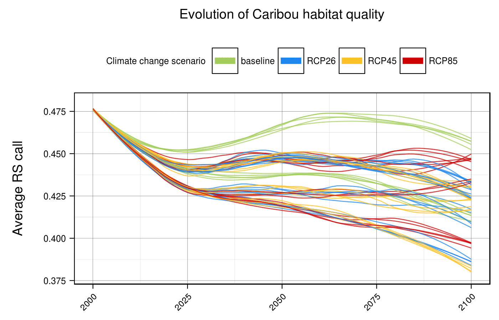
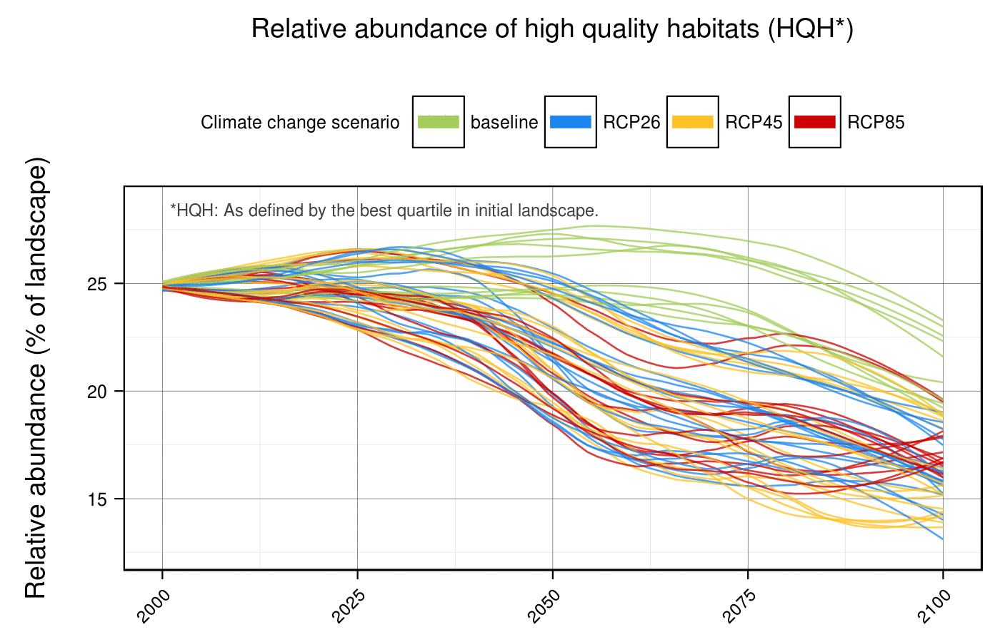
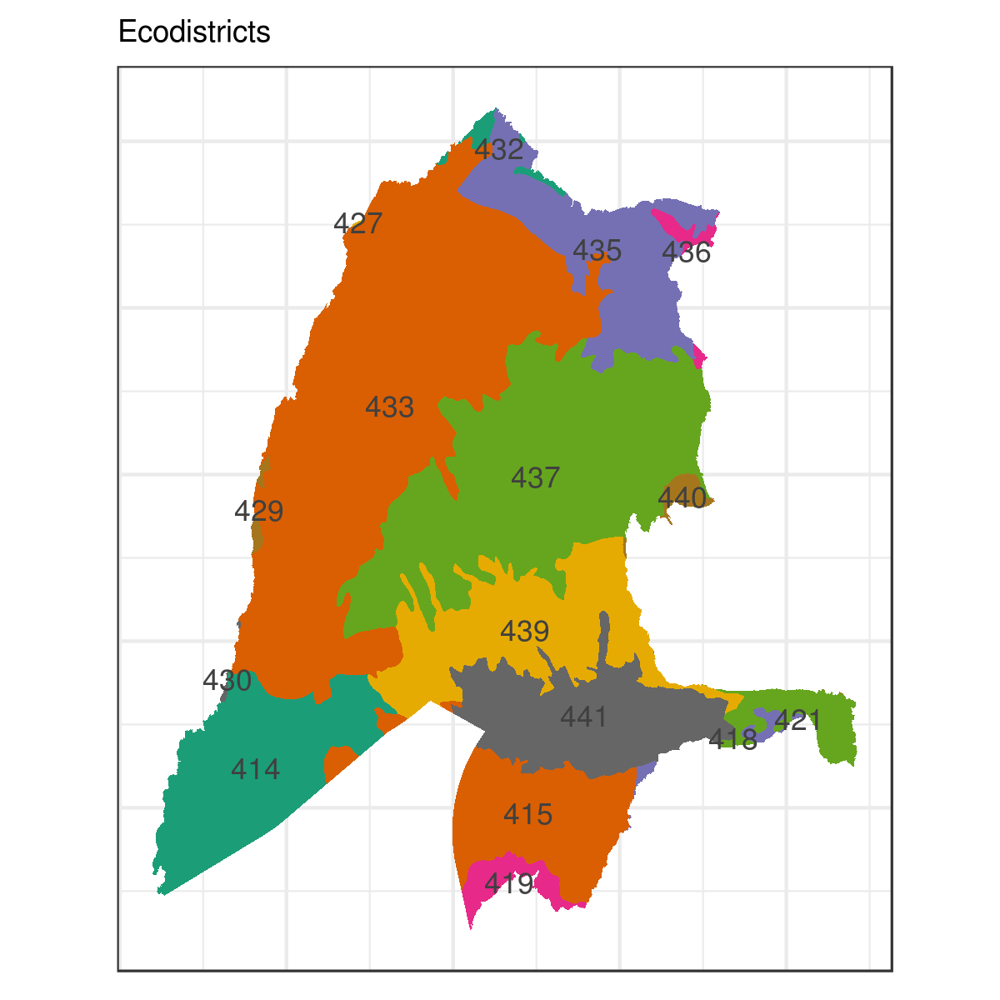
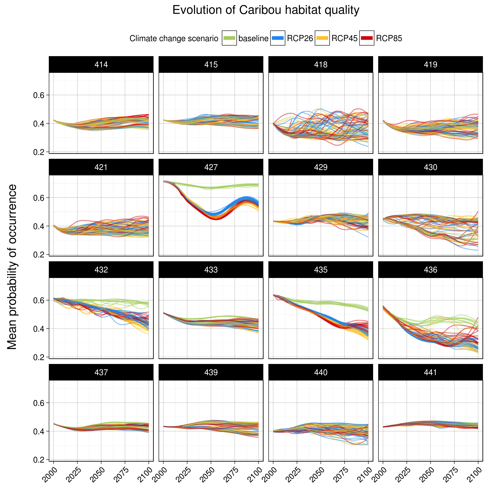

# Caribou Resource Selection Projection (2000-2100) - Preliminary Results
Dominic Cyr  

Updated on Sep 20 2016

-------

These are preliminary results obtained by applying a Resource Selection Function (RSF) for Caribou (forest-dweling ecotype) to a LANDIS-II simulation ensemble in the Lac St-Jean area. More details about the RSF itself and its implementation can be found [here][1] (to be completed soon).

### Simulation ensemble description

* A total of 67 simulations make up the simulation ensemble.  
* Climate change scenarios, fire regimes, and harvesting levels define each simulated treatment.  
* Fire regimes and climate change scenarios are simulated coupled with each other, as well as uncoupled (using the baseline fire regime).
* Each treatments are replicated 5 times (with a few examples). 

If you prefer visualizing the following results with static figures instead of animations, click on the links below each one of them (or [clone the entire repo][2]).

### Results (preliminary)

#### Mean probability of occurrence (averaged over entire landscape)

The harvesting levels, relative to recent year levels, are the most important determinant of Caribou's future probability of occurrence when averaged over the entire landscape. Harvesting are inversely proportional to Caribou's future probability of occurrence.

Harvesting levels are followed by climate change scenarios and fire regimes, which both also have subtantial impacts on Caribou's future probability of occurrence. The detrimental effects of climate change and fire regime increase with the intensity of the radiative forcing.

Future probability of occurrence remains stable only under the baseline climate change scenario, when harvesting levels are set to 50% compared to recent year levels.

Static figures - Entire landscape (averages)  

* [Climate change scenario][3]  
* [Fire regime][4]  
* [Harvesting level][5]  

#### High quality habitats (averaged over entire landscape)

Trends are similar for the relative abundance of high quality habitats, which were defined using thresholds derived from initial conditions. (Each curves indicate the proportion of the landscape that contains habitats with greater RS probability than those associated with the top 10th and 25th percentiles in the initial landscape.)

Static figures - Entire landscape (High quality habitats)  

* [Climate change scenario][6]  
* [Fire regime][7]  
* [Harvesting level][8]  

-------

The response of Caribou future resource selection to the various sources of uncertainty will be heterogenous throughout the landscape.

#### Mean probability of occurrence (averaged by ecodistrict) 

While most of the ecodistricts follow the same trends as those described for the entire landscapes, the northermost ecodistricts (432, 435, 436) appear to be most sensitive to changes in fire regimes.

Static figures - By ecodistrict (averages)  

* [Climate change scenario][9]  
* [Fire regime][10]  
* [Harvesting level][11]  

-------

[1]: https://github.com/dcyr/caribouRSF
[2]: https://github.com/dcyr/caribouRSF/archive/master.zip
[3]: https://raw.githubusercontent.com/dcyr/caribouRSF/master/figures/caribouRS_mean_total_scenario.png
[4]: https://raw.githubusercontent.com/dcyr/caribouRSF/master/figures/caribouRS_mean_total_fire.png
[5]: https://raw.githubusercontent.com/dcyr/caribouRSF/master/figures/caribouRS_mean_total_harvest.png
[6]: https://raw.githubusercontent.com/dcyr/caribouRSF/master/figures/caribouRS_HQH_total_scenario.png
[7]: https://raw.githubusercontent.com/dcyr/caribouRSF/master/figures/caribouRS_HQH_total_fire.png
[8]: https://raw.githubusercontent.com/dcyr/caribouRSF/master/figures/caribouRS_HQH_total_harvest.png
[9]: https://raw.githubusercontent.com/dcyr/caribouRSF/master/figures/caribouRS_mean_ecodistrict_scenario.png
[10]: https://raw.githubusercontent.com/dcyr/caribouRSF/master/figures/caribouRS_mean_ecodistrict_fire.png
[11]: https://raw.githubusercontent.com/dcyr/caribouRSF/master/figures/caribouRS_mean_ecodistrict_harvest.png
