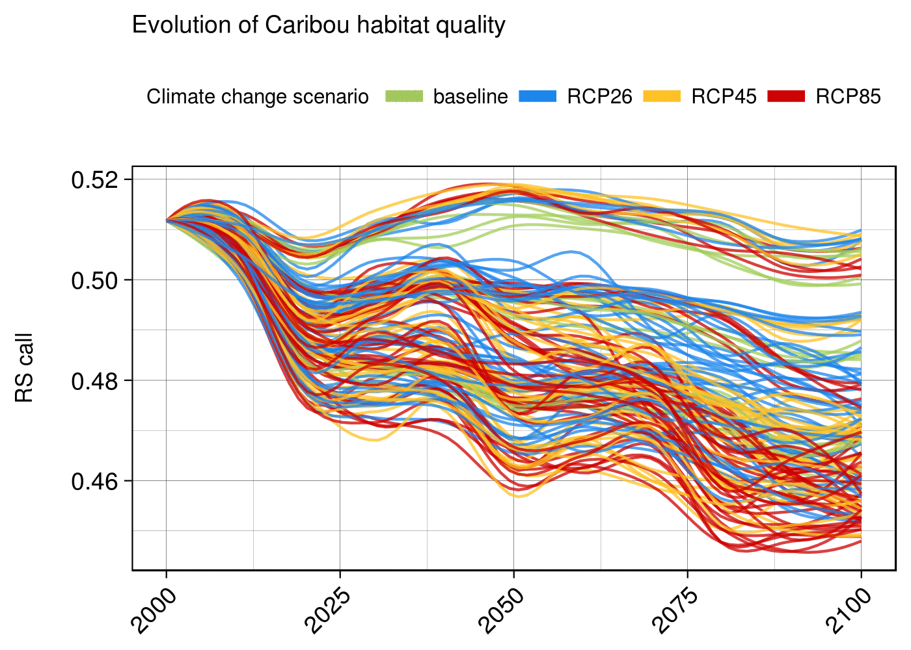
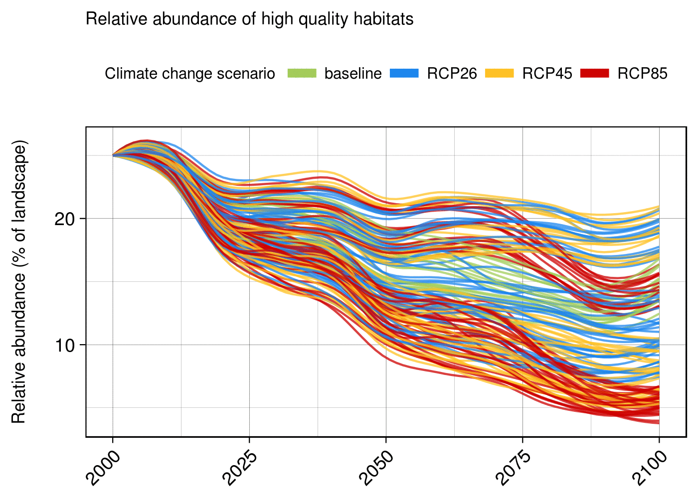
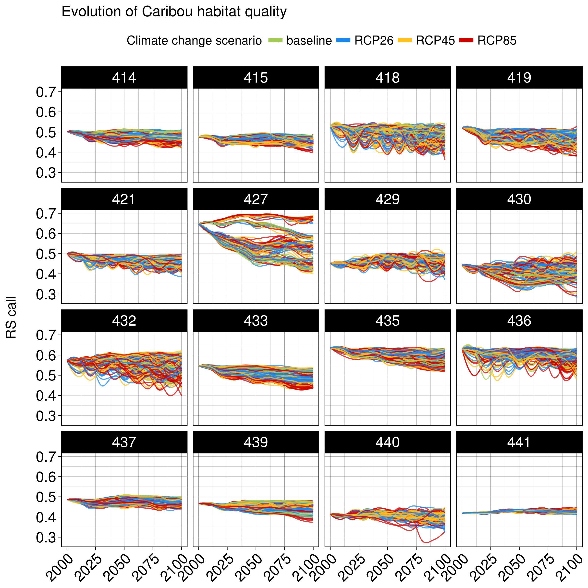

# Caribou Resource Selection Projection (2000-2100) - Preliminary Results
Dominic Cyr  

Updated on Sep 27 2017

-------

The following results describe projections of se are preliminary results obtained by applying a Resource Selection Function (RSF) for Caribou (forest-dweling ecotype) to a LANDIS-II simulation ensemble in the Lac St-Jean area.

A resource selection function (RSF) is any model that yields values proportional to the probability of use of a resource unit ([__Boyce *et al.* 2002__][001]).

### Description of simulation ensemble

&nbsp;

#### Baseline climate

Factor | Levels | Number of levels  
----------|----------|:--------:  
Climate change scenario &nbsp;&nbsp; | baseline &nbsp;&nbsp;&nbsp;&nbsp;&nbsp; | __1__  
Fire regime | baseline | __1__
Harvesting levels | 0%, 50%, 100% | __3__  

* 3 treatments with baseline climate (1 scenario x 1 fire regime x 2 harvesting levels)  

&nbsp; 

#### Projected climate

Factor | Levels | Number of levels  
----------|----------|:--------:
Climate change scenario &nbsp;&nbsp; | RCP 2.6, RCP 4.5, RCP 8.5 | __3__  
Fire regime | baseline, projection1 | __2__
Harvesting levels | 0%, 50%, 100% | __3__ 

1Fire regimes projections are based on the climate change scenario being simulated, i.e. corresponding RCP. 

* 18 treatments with projected climate (3 scenarios x 2 fire regimes x 3 harvesting levels) 

&nbsp; 

#### Summary

Each of the 21 treatments was replicated 5 times.   

* __Total:__ 105 simulations  
  

-------

*Climate change scenarios, fire regimes, and harvesting levels define each simulated treatment.  

* Each treatments are replicated 5 times.

Projected climate (RCPs): 3
baseline simulations: 

More details about the RSF itself and its implementation can be found [here][1] (to be completed soon).

### Simulation ensemble description

If you prefer visualizing the following results with static figures instead of animations, click on the links below each one of them (or [clone the entire repo][2]).

### Results (preliminary)

#### Mean probability of occurrence (averaged over entire landscape)

The harvesting levels, relative to recent year levels, and fire regime are the most important determinants of Caribou's future probability of occurrence when averaged over the entire landscape. Caribou's future probability of occurrence is inversely proportional to harvesting level.

The impact of climate change on individual species' performances and emerging stand-level interactions have much less impacts on Caribou's future probability of occurrence.

Future probability of occurrence remains stable only under the baseline climate change scenario, when no harvesting at all is done.

Static figures - Entire landscape (averages)  

* [Climate change scenario][3]  
* [Fire regime][4]  
* [Harvesting level][5]  

#### High quality habitats (averaged over entire landscape)

The abundance of high quality habitats (HQH), defined using thresholds corresponding to the top 25% habitats in the initial landscape, is mostly affected by fire regime, followed by harvesting level. (Each curves indicate the proportion of the landscape that contains habitats with RS probability greater than those associated with the top 25th percentiles in the initial landscape.)

Static figures - Entire landscape (High quality habitats)  

* [Climate change scenario][6]  
* [Fire regime][7]  
* [Harvesting level][8]  

-------

The response of Caribou future resource selection to the various sources of uncertainty will be heterogenous throughout the landscape.

#### Mean probability of occurrence (averaged by ecodistrict) 

Static figures - By ecodistrict (averages)  

* [Climate change scenario][9]  
* [Fire regime][10]  
* [Harvesting level][11]  

-------

[001]: http://www.whoi.edu/cms/files/Ecological_Modelling_2002_Boyce_53558.pdf

[1]: https://github.com/dcyr/caribouRSF
[2]: https://github.com/dcyr/caribouRSF/archive/master.zip
[3]: https://raw.githubusercontent.com/dcyr/caribouRSF/master/figures/caribouRS_mean_total_scenario.png
[4]: https://raw.githubusercontent.com/dcyr/caribouRSF/master/figures/caribouRS_mean_total_fire.png
[5]: https://raw.githubusercontent.com/dcyr/caribouRSF/master/figures/caribouRS_mean_total_harvest.png
[6]: https://raw.githubusercontent.com/dcyr/caribouRSF/master/figures/caribouRS_HQH_total_scenario.png
[7]: https://raw.githubusercontent.com/dcyr/caribouRSF/master/figures/caribouRS_HQH_total_fire.png
[8]: https://raw.githubusercontent.com/dcyr/caribouRSF/master/figures/caribouRS_HQH_total_harvest.png
[9]: https://raw.githubusercontent.com/dcyr/caribouRSF/master/figures/caribouRS_mean_ecodistrict_scenario.png
[10]: https://raw.githubusercontent.com/dcyr/caribouRSF/master/figures/caribouRS_mean_ecodistrict_fire.png
[11]: https://raw.githubusercontent.com/dcyr/caribouRSF/master/figures/caribouRS_mean_ecodistrict_harvest.png
